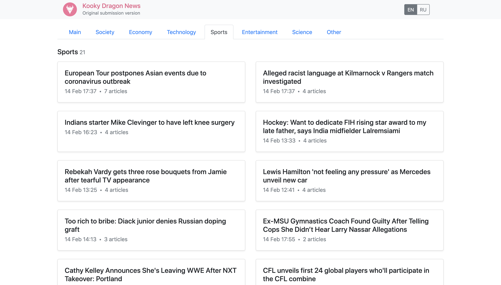

# Telegram Data Clustering Contest Submission

*by Kooky Dragon ([Andy](https://github.com/Andy671) and [Mikita](https://github.com/mbalesni))*

## Demo

[https://mbalesni.github.io/tgnews](https://mbalesni.github.io/tgnews)

## Description

The task of the contest was to create a command-line application for classifying and sorting news articles. See more details on the [official contest page](https://contest.com/data-clustering).

### Solution commentary

Our solutions to tasks 1, 2, 3 are based on supervised learning using *fasttext*

 - For the English dataset, we used the Google Cloud NLP text categorization service to label the Telegram-provided sample datasets.

 - For the Russian dataset, we used Google Translate to translate part of the English dataset into Russian.

Our solutions to task 4 and 5 are using *DBSCAN* from scikit-learn.

___

It was our first experience with NLP, so this contest was rather challenging for us. However, we had A LOT of fun! Thank you for this opportunity ;)
